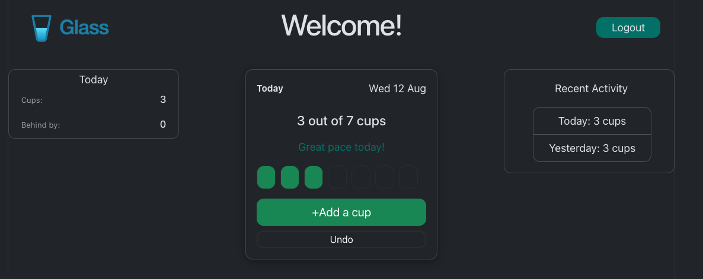

# Glass
 
A hydration tracker built to track one's hydration goals. This app was built to actually be used, not just demonstrated. Log a cup, see your progress against a daily target, and look back over the last few days.
 
Built as a full-stack learning project covering containerisation, REST API design, relational data modelling, and token-based authentication.


 
---
 
## Tech stack
 
| Layer | Technology |
|---|---|
| Frontend | React 19 with TypeScript, Vite, Bootstrap 5 |
| API | FastAPI (Python 3.12) |
| ORM | SQLModel (SQLAlchemy + Pydantic) |
| Database | PostgreSQL 18 |
| Auth | JWT (PyJWT), bcrypt password hashing |
| Containers | Docker Compose |
 
---
 
## Key features (constantly changing)
 
**Account management:** Lets users create accounts using a username and a password (password constraints not implemented as yet). Passwords are hashed with bcrypt using a per-user salt so that the plaintext is never stored and never leaves the request that created it.
 
**Authenticated sessions:** User logins return a signed JWT token with an hour's expiry limit. Every subsequent request carries it in an `Authorization` header, and the API verifies the signature independently on each one. This makes it so a server-side session state is not required.
 
**Data isolation:** Every query filters by the current authenticated user. A logged-in user cannot read or delete another user's entries, including by guessing record IDs. Lookups join through the habit table and filter on ownership rather than fetching by ID and checking afterwards.
 
**Daily tracking:** Log a cup with one click. The interface shows progress against a target as a row of filled and empty "cups", with an undo button for accidental logs.
 
**Correct day boundaries:** Timestamps are stored as postgres' `TIMESTAMPTZ` in UTC. The user's current day is computed by shifting each timestamp into the user's timezone before comparing against that timezone's current date so that a cup logged at 11pm counts toward the right day rather than falling into the next UTC one.
 
**History.** A `GROUP BY` aggregation returns per-day totals for the last *n* days, labelled relative to today where that reads more naturally.
 
---
 
## Architecture
 
The app runs with a three-container structure with a docker compose network:
 
```
Browser                    Container network
┌──────────────┐          ┌──────────────────┐        ┌──────────────┐
│ React (Vite) │  HTTP    │ FastAPI          │  SQL   │ PostgreSQL   │
│ :5173        │ ───────► │ :8000            │ ─────► │ :5432        │
└──────────────┘  JSON    └──────────────────┘        └──────────────┘
```
 
The frontend never talks to the database. It knows only about URLs and JSON shapes. The API on the other hand, owns the connection string, the credentials, and every authorization decision. Anything enforced only in the browser can be bypassed, thus, nothing is.
 
### Data model
 
```
users                habits                    entry
─────                ──────                    ─────
id                   id                        id
username (unique)    user_id  → users.id       habit_id → habits.id
password_hash        name                      logged_at (TIMESTAMPTZ)
created_at           target                    amount
                     unit
```
 
One user has many habits; one habit has many entries. Entries reach their owner through the habit, so authorisation is a join operation rather than a duplicated `user_id` column.
 
The `habits` table currently holds one row per user — water — created automatically at registration, done to allow for future expansion to other habits.
---
 
## Running it
 
**Prerequisites:** Docker Desktop.
 
```bash
git clone https://github.com/sainair/hydration-tracker.git
cd hydration-tracker
```
 
Create a `.env` in the project root:
 
```
POSTGRES_DB=hydration
POSTGRES_USER=postgres
POSTGRES_PASSWORD=<choose one>
SECRET_KEY=<see below>
TIMEZONE=Asia/Qatar
```
 
Generate the JWT signing key:
 
```bash
python3 -c "import secrets; print(secrets.token_hex(32))"
```
 
Then:
 
```bash
docker compose up --build
```
 
| Service | URL |
|---|---|
| App | http://localhost:5173 |
| API docs | http://localhost:8000/docs |
| Database | localhost:5432 |
 
`.env` is gitignored. The `SECRET_KEY` is what signs every token — anyone holding it can forge a token for any user, so it belongs in a secret manager rather than a repository.
 
---
 
## API
 
| Method | Path | Auth | Description |
|---|---|---|---|
| `POST` | `/users/` | — | Register. Returns the user without the password hash. |
| `POST` | `/auth/login` | — | Verify credentials, return a signed JWT. |
| `GET` | `/entries/today` | ✓ | Today's entries in the configured timezone. |
| `POST` | `/entries/` | ✓ | Log a cup against the user's habit. |
| `DELETE` | `/entries/{id}` | ✓ | Remove an entry the user owns. |
| `GET` | `/history/` | ✓ | Per-day totals, newest first. Accepts `?days=n`. |
 
Interactive documentation is generated from the type hints and available at `/docs` (Port 8000).
 
---
 
## Design decisions
 
**`TIMESTAMPTZ`, not `TIMESTAMP`.** Both store UTC internally, but only `TIMESTAMPTZ` knows it represents an instant and converts correctly on the way out. A timestamp on the other hand would simply be like a wall-clock reading with no timezone attached, and the resulting bugs would only surface near midnight, being correct only twenty-one hours a day.
 
**Day boundaries computed per request, not stored.** Grouping happens at read time using `AT TIME ZONE`, which means entries re-bucket if the timezone changes. This works great for a   personal tracker . An app where historical days must stay fixed would store the offset alongside each entry.
 
**Identical responses for both login failures.** An unknown username and a wrong password return the same 401 with the same message. Distinguishing them would let anyone probe the endpoint to discover which accounts exist.
 
**404, not 403, for entries the user does not own.** Returning "forbidden" confirms the record exists. From outside, another user's entry should be indistinguishable from one that was never created.
 
**Count derived, not stored.** The number of cups today is `entries.length` in the frontend and a `SUM` in the database. Storing it separately would create two sources of truth that can disagree.
 
**Usernames rather than email addresses.** Password reset requires a verified email address, an email provider, expiring single-use tokens, and rate limiting to prevent account enumeration. That is a meaningful amount of infrastructure for a personal tool. With real users the tradeoff reverses, since a forgotten password currently means a lost account.
 
---
 
## Roadmap
 
**Near term**
 
- Persist the token so a page refresh does not log the user out, with handling for the expired-token case
- Logout
- Editable daily target — the column exists, the interface does not
- Per-entry deletion from the activity list, rather than undo alone
- Variable amounts per entry, so a 500ml bottle is one record rather than two
**Later**
 
- Multiple habits per user — the schema already supports this
- Alembic migrations, replacing `create_all`, which creates missing tables but never alters existing ones
- Streaks and goal-completion history
- Client-side timezone detection instead of a server-side constant
---
 
## Project structure
 
```
glass/
├── backend/
│   ├── app.py              # models, endpoints, auth
│   ├── requirements.txt
│   └── Dockerfile
├── src/
│   ├── components/         # Card, Login, ActivityLog, Header, CurrentDate
│   ├── App.tsx
│   └── App.css
├── public/
├── compose.yml
├── Dockerfile              # frontend
└── .env                    # not committed
```
 
---
 
## Notes
 
This project was made for learning purposes and personal use ONLY. The authentication is implemented carefully but has not been audited, and it runs locally, not in production. Both are on the roadmap rather than claimed as finished.